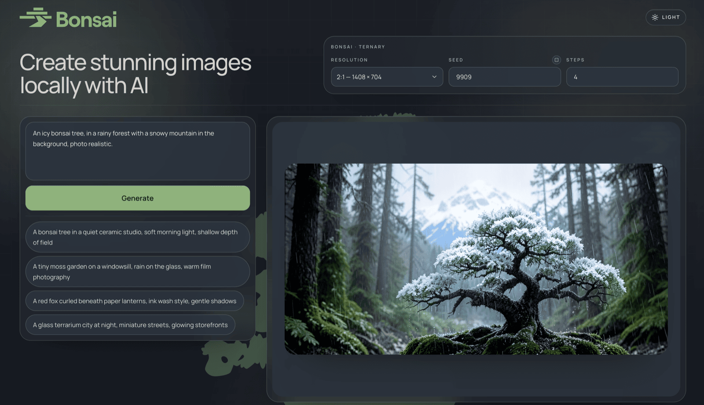

# Bonsai Image Demo

<p align="center">
  
</p>

<p align="center">
  <a href="https://prismml.com"><b>Website</b></a> &nbsp;|&nbsp;
  <a href="https://github.com/PrismML-Eng/Bonsai-Image-Demo"><b>GitHub</b></a> &nbsp;|&nbsp;
  <a href="https://discord.gg/prismml"><b>Discord</b></a>
</p>

<p align="center">
  <b>HF Collections:</b>
  <a href="https://huggingface.co/collections/prism-ml/bonsai-image">Bonsai-Image</a>
  &nbsp;|&nbsp;
  <b>Whitepapers:</b>
  <a href="bonsai-image-4b-whitepaper.pdf">Bonsai-Image 4B</a>
</p>

<p align="center">
  <b>Other Demos:</b>
  <a href="https://huggingface.co/spaces/prism-ml/Bonsai-image-demo">HuggingFace Space</a> ·
  <a href="https://colab.research.google.com/github/PrismML-Eng/Bonsai-image-demo/blob/main/notebooks/bonsai_image_colab.ipynb">Google Colab</a>
</p>

> **Placeholder:** the Google Colab notebook link still points at a URL
> that doesn't exist yet. Swap once the notebook lands publicly.

---

Generate images with Bonsai on Apple Silicon (macOS via [mflux](https://github.com/filipstrand/mflux) + MLX), NVIDIA GPU (Linux via [gemlite](https://github.com/dropbox/gemlite) + [HQQ](https://github.com/dropbox/hqq) kernels in `backend_gpu`), or NVIDIA GPU on **Windows natively** (same gemlite/HQQ stack via [triton-windows](https://github.com/triton-lang/triton-windows), no WSL2 needed).

## Quick start

**macOS / Linux:**

```bash
./setup.sh
./scripts/generate.sh --prompt "An icy Bonsai tree, in a rainy forest with a snowy mountains in the background, photo realistic."
```

**Windows (PowerShell):**

```powershell
Set-ExecutionPolicy -Scope CurrentUser RemoteSigned   # one-time; PowerShell blocks .ps1 files by default
$env:BONSAI_TOKEN = 'hf_...'                          # until weights go public
.\setup.ps1
.\scripts\generate.ps1 -p "An icy Bonsai tree, in a rainy forest with a snowy mountains in the background, photo realistic."
```

If something doesn't work on Windows, see [scripts/windows.md](scripts/windows.md) for prereqs and the FAQ of known failure modes (execution policy, missing git, old NVIDIA driver, vcredist, ports in use, OOM at 1024x1024, etc).

> Bonsai models are currently private. Set `BONSAI_TOKEN=hf_…` (or run
> `huggingface-cli login` once) until the public launch.

## Download models

```bash
./scripts/download_model.sh                # ternary (default), picks mlx on macOS, gemlite on Linux
./scripts/download_model.sh ternary        # same — explicit
./scripts/download_model.sh binary         # binary 1-bit, platform-aware
./scripts/download_model.sh --model binary-gemlite   # full form, override the backend choice
```

Ternary (1.58-bit) is the recommended demo variant — better quality at a modest size increase. Binary (1-bit) is the smaller / lighter sibling.

## Configuration

| Variable | Values | Default |
|----------|--------|---------|
| `BONSAI_TOKEN` | HuggingFace token | needed until public launch |
| `BONSAI_VARIANT` | `ternary` (1.58-bit) / `binary` (1-bit) | `ternary` |
| `BONSAI_PACKAGE_MIN_AGE_DAYS` | int | `7` |

`BONSAI_VARIANT` is honored by both `setup.sh` (picks which weights to download) and `serve.sh` (picks which model the studio loads). Set it once per session: `BONSAI_VARIANT=binary ./setup.sh` then `BONSAI_VARIANT=binary ./scripts/serve.sh`.

By default, `setup.sh` and `serve.sh` refuse to install any Python or npm
package version that was published less than `BONSAI_PACKAGE_MIN_AGE_DAYS=7`
days ago, via `uv sync --exclude-newer` and `npm install --before`. This is
a defense against fresh supply-chain compromises that haven't been caught and fixed by the time
you run `setup.sh`. Set `BONSAI_PACKAGE_MIN_AGE_DAYS=0` to disable.

## Running the full studio (backend + frontend)

<p align="center">
  
</p>

`scripts/serve.sh` brings up prism-image-studio's FastAPI backend on `:8000`
(pointed at this repo's `models/`) and the Next.js frontend on `:3000`,
both in the foreground. Ctrl+C tears them down together.

```bash
# default: ternary, ports 8000/3000
./scripts/serve.sh                       

# custom 
BACKEND_PORT=8800 FRONTEND_PORT=3100 ./scripts/serve.sh
```

The frontend lives in `vendor/image-studio` (cloned by `setup.sh`; override
path via `STUDIO_DIR=...`). First run installs `frontend/node_modules`
automatically.

## Generating images (CLI)

> **Recommended path**: run `./scripts/serve.sh` once and use either the
> studio UI in your browser or `./scripts/send_request.sh -p "…"` from the
> terminal. Both talk to the running backend.
>
> `./scripts/generate.sh` is a fallback for when you genuinely need a
> one-shot run without a running serve.sh. It pays the
> cold-start cost (imports + model load + first-shape JIT) every time.

### `send_request.sh` - HTTP client to talk to a running studio

Same flag surface as `generate.sh`, but each call POSTs to the studio's
`/generate` so weights and kernels stay warm across renders:

```bash
./scripts/send_request.sh -p "An icy bonsai tree, in a rainy forest with a snowy mountain in the background, photo realistic." --size 1248x832 --seed 9909
BACKEND_PORT=8800 ./scripts/send_request.sh -p "..."     # custom server
```

### `generate.sh` — one-shot, no server

In-process wrapper around `scripts/generate.py`, drives
[`prism-image-studio`](vendor/image-studio)'s `FluxPipeline` against the
local `models/` tree:

```bash
./scripts/generate.sh -p "An icy bonsai tree, in a rainy forest with a snowy mountain in the background, photo realistic." --size 1248x832 --seed 9909 --output outputs/icy_bonsai.png --open
```

Default is 512×512 (fast preview). Dimensions have to be multiples of 32. Suggested sizes are:

| Aspect            | Fast (~0.25MP) | Quality (~1MP) |
|-------------------|----------------|----------------|
| Square (1:1)      | 512×512        | 1024×1024      |
| Landscape (3:2)   | 624×416        | 1248×832       |
| Portrait (2:3)    | 416×624        | 832×1248       |
| Wide (2:1)        | 704×352        | 1408×704       |
| Tall (1:2)        | 352×704        | 704×1408       |


## Folder structure after setup

```
Bonsai-image-demo/
  .venv/
  vendor/                              # private deps cloned by setup.sh/.ps1
    image-studio/                      # FastAPI backend + Next.js frontend
    mflux-prism/                       # mflux fork with prism patches
  models/
    bonsai-image-4B-ternary-mlx/       # macOS only (default)
    bonsai-image-4B-ternary-gemlite/   # Linux / Windows (default)
    bonsai-image-4B-binary-mlx/        # macOS only   (optional, smaller 1-bit)
    bonsai-image-4B-binary-gemlite/    # Linux / Windows (optional, smaller 1-bit)
  outputs/
  .serve-logs/                         # logs from serve.sh / serve.ps1
  setup.sh                             # macOS + Linux entry point
  setup.ps1                            # Windows entry point (parallel to setup.sh)
  scripts/
    common.sh                          # shared bash helpers
    common.ps1                         # shared PowerShell helpers
    download_model.sh / .ps1
    serve.sh        / .ps1               # primary: backend + frontend studio
    send_request.sh / .ps1               # HTTP client to a running serve
    generate.sh     / .ps1               # one-shot CLI (cold-start every call)
    generate.py                          # Python entry behind generate.{sh,ps1}
```
